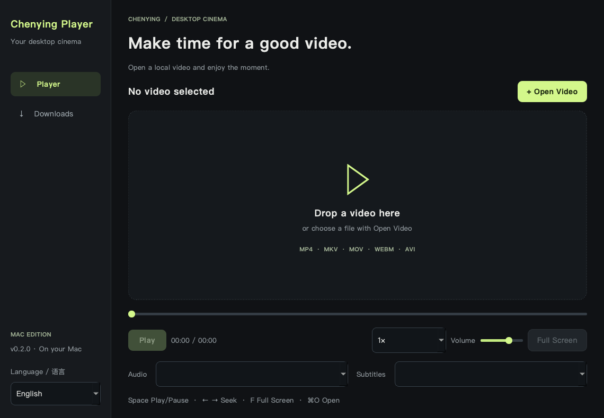
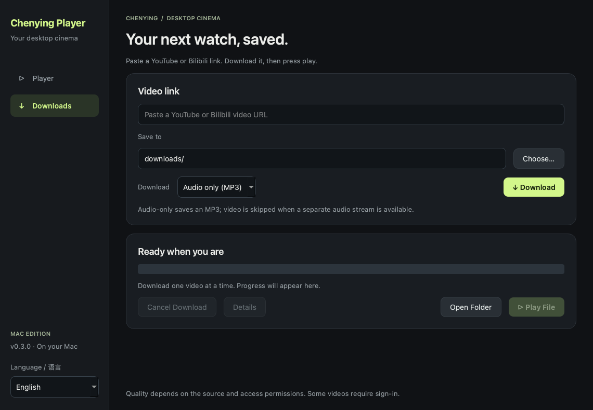

# CY Player

**Chenying Player · 辰映** — a macOS video player with English and Simplified Chinese interfaces, local playback, and single-video downloads from YouTube and Bilibili.

English | [简体中文](README.zh-CN.md)



## Features

- Switch **English / 简体中文** using **Language / 语言** at the bottom of the sidebar. The preference is saved automatically; switching preserves playback and download state.
- Open or drag in local videos. Play, pause, seek, adjust volume and playback speed, and enter full screen.
- Select embedded audio and subtitle tracks.
- Software AV1 decoding supports playback on Macs without AV1 hardware decoding.
- Paste a YouTube or Bilibili video URL, choose MP4, MKV or WebM, a quality limit and destination, monitor progress, cancel, and play the result.
- Choose **Video + audio** or **Audio only (MP3)**. Audio-only prefers a separate audio stream and saves a 192 kbps MP3; video quality controls do not apply.
- Automatic downloads use up to four verified HTTP range connections, or four native stream fragments. Bilibili backup routes are checked where available; slow chunks can retry another verified route. Unsupported range downloads fall back to the standard downloader. Speed still depends on the site and connection.
- One download at a time. Verified chunks and native partial files are kept so retrying the same link and download type can resume.

Playback uses **PySide6 / Qt Multimedia with FFmpeg**. Downloads use **yt-dlp**, **FFmpeg**, and **Node.js** for YouTube JavaScript challenges. A file extension alone does not guarantee codec support.

## Launch on this Mac

Double-click **CY Player.app** in the supplied project folder. Keep the entire folder together: the top-level app shortcut points to the application in `dist`, while Node.js, settings, caches and downloads remain alongside it. The bundled build targets Apple Silicon and macOS 13.5 or later.

The `启动播放器.command` launcher is an alternative entry point to the same packaged application.

Settings are stored in `cache/settings.json`; downloads default to `downloads`. Project dependencies and build files stay in the supplied folder. Operating-system logs and application registration are managed by macOS.

## Run from source

Use Python 3.12 or later:

```sh
python3 -m venv .venv
source .venv/bin/activate
pip install -r requirements.txt
python app.py
```

For this delivery, the source is in `project` and the data root is its parent. For a normal clone, the source directory is the data root. Set `YINGZHOU_ROOT` to override it; this environment variable is retained for compatibility.

For full YouTube support, place Node.js 20 or later at `runtime/tools/node` under the data root. The local delivery already includes it. Downloads use the source-built FFmpeg tools at `runtime/media-tools/ffmpeg` and `ffprobe`. Packaged apps carry these tools inside the app; old `runtime/tools/ffmpeg` links are ignored. The supplied build needs no global FFmpeg installation. To prepare a fresh source checkout, follow [the media-tool build instructions](tools/README.md) before downloading media.

## Shortcuts

| Action | Shortcut |
|---|---|
| Open a video | ⌘O |
| Play / pause | Space |
| Seek backward / forward 5 seconds | ← / → |
| Toggle full screen | F or double-click the video |
| Exit full screen | Esc |

## Source layout

- `app.py`: interface, playback, language switching and download process management.
- `i18n.py`: English / Chinese application text.
- `download_worker.py`: isolated download worker with structured progress messages.
- `core.py`: paths, settings, URL validation and FFmpeg discovery.
- `test_core.py`, `test_downloads.py`, `test_formats.py`, `test_i18n.py`: validation, download integrity, output formats, preferences, translations and playback regression tests.
- `build_mac.sh`: local PyInstaller build; output goes to the parent folder's `dist` directory. Set `CY_BUILD_DIST` to an absolute output directory to build a separate candidate.
- `build_hooks/`: keeps native macOS input and playback plugins while excluding unused PDF and on-screen keyboard plugins before dependency collection.

Tests can run with `QT_QPA_PLATFORM=offscreen python -m unittest discover -p 'test_*.py'`. Tests use isolated temporary settings. The media test uses the local fixture when available or generates a short one with FFmpeg.

## Current limits

- The first version connects directly and does not change system proxy settings.
- Account sign-in, cookie import, batch playlists, external subtitles and automatic updates are not included.
- Private, paid, region-restricted or anti-bot-protected videos may fail. Browser cookies are never read automatically.
- Video and audio may download separately, so progress can restart for the next stream; merging uses an indeterminate indicator.
- App-owned labels and messages follow the language selector. Native macOS file-dialog controls follow the system language; media titles, paths and upstream diagnostic details retain their original text.
- Site changes can require a yt-dlp update. Successful test links do not guarantee every video will work.
- Save only content you are entitled to download.
- The local app has an ad-hoc signature, not an Apple Developer ID signature or notarization. Distribution to other Macs needs separate preparation.

## GitHub

Publish this source directory. Keep runtime dependencies, caches, build outputs, downloaded videos and personal settings out of the repository.

See [THIRD_PARTY.md](THIRD_PARTY.md) for dependency sources and license information. Original CY Player code is licensed under **GPL-3.0-or-later**; see [LICENSE](LICENSE) and [COPYRIGHT](COPYRIGHT). Third-party components retain their own terms.



## 0.3.1 — video format selection

Choose **MP4**, **MKV**, or **WebM** beside Quality before downloading. MP4 is the default; the choice is saved when the app closes. Downloads keep the source codecs without re-encoding. WebM needs compatible source streams; if the selected quality and format are unavailable, choose another combination. Audio-only still saves MP3. Different formats can coexist in the same folder; unfinished downloads are stored in `.cy-downloads` and can resume with the same format selection.
