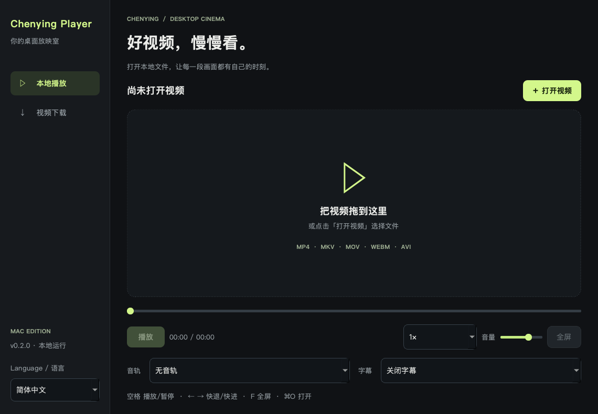
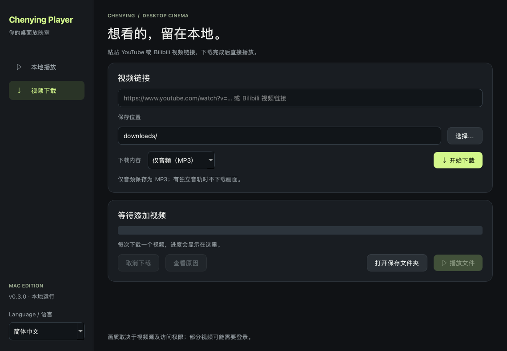

# CY Player · Chenying Player（辰映）

一个支持中文和英文的桌面视频播放器，支持本地播放，以及 YouTube / Bilibili 单视频下载。

[English](README.md) | 简体中文



## 功能

- 左下角 **Language / 语言** 可即时切换 English / 简体中文，并自动记住选择。首次启动默认英文；切换时保留播放状态和下载任务。
- 拖入或选择本地视频；播放、暂停、进度拖动、音量、倍速、全屏。
- 选择文件内的音轨和内嵌字幕。
- 粘贴 YouTube、youtu.be、Bilibili 或 b23.tv 链接，选择画质和保存位置。
- 下载独立运行，支持进度显示、取消、失败提示，以及下载完成后播放。
- 一次下载一个视频；未完成的 `.part` 文件保留，可由 yt-dlp 尝试续传。

播放基于 **PySide6 / Qt Multimedia 的 FFmpeg 后端**。常见扩展名不代表所有编码都兼容，具体以测试结果为准。下载使用 **yt-dlp + FFmpeg**，Node.js 用于 YouTube 的 JavaScript 解析。

## 在这台 Mac 上使用

双击上一级文件夹内的 `CY Player.app`。保留整个“视频播放器”文件夹，不要单独移动 `.app`：正式应用位于 `dist`，顶层入口链接到它；Node.js、缓存和设置保留在同一根目录。备用启动方式使用独立 Python 环境。

备用方式：双击 `启动播放器.command`。

所有为本项目新增的运行环境、依赖、缓存、构建文件均位于该文件夹。程序自己的设置保存在 `cache/settings.json`，下载默认位于 `downloads`。macOS 自行维护的系统日志、应用注册记录不属于项目可控制的文件。

## 从源码运行

需要 Python 3.12+；当前本机版本面向 Apple Silicon、macOS 13+。

```sh
python3 -m venv .venv
source .venv/bin/activate
pip install -r requirements.txt
python app.py
```

本机 `project` 布局下，根目录为源码目录的上一级；普通 GitHub 克隆目录则以源码目录自身为根目录。可通过 `YINGZHOU_ROOT` 明确指定运行数据根目录。首次运行会在根目录创建 `cache`、`tmp`、`runtime/tools` 和 `downloads`。

YouTube 的完整解析还需要 Node.js 20+，放到根目录下的 `runtime/tools/node`。本机交付已包含 Node.js。FFmpeg 由 imageio-ffmpeg 包提供，首次下载时创建 `runtime/tools/ffmpeg` 链接，不进行全局安装。

## 快捷键

| 操作 | 快捷键 |
|---|---|
| 打开文件 | ⌘O |
| 播放 / 暂停 | 空格 |
| 前进 / 后退 5 秒 | → / ← |
| 切换全屏 | F 或双击画面 |
| 退出全屏 | Esc |

## 项目结构

- `app.py`：界面、播放控制和下载进程管理。
- `download_worker.py`：单独的下载进程，向界面输出结构化进度。
- `core.py`：目录、链接校验、设置、FFmpeg 定位。
- `i18n.py`：中英文界面文字。
- `test_i18n.py`：语言保存、进度与错误翻译、播放和下载状态保持测试。
- `test_core.py`：链接边界和时间格式测试。
- `build_mac.sh`：PyInstaller 打包脚本；已在本机完成打包，日常使用无需重新构建。

## 已知边界

- 应用界面和提示跟随语言开关；macOS 原生文件选择窗口中的系统控件跟随系统语言。视频标题、文件路径和第三方原始诊断保留原文。

- 第一版通过直接连接访问网站，不修改系统代理设置。
- 第一版未提供账号登录、Cookie 导入、播放列表批量下载、外部字幕或自动更新。
- 下载只处理单视频。涉及登录、付费、地域或平台风控的链接可能失败；不会自动读取浏览器 Cookie。
- 视频和音频分开下载时，进度可能分段重新计数；合并时显示不定进度。
- 网站规则会变化，必要时需要更新 yt-dlp；具体在线测试结果见上一级的 `测试结果.md`。
- 使用者负责选择有权保存的内容。
- 仅有本机 ad-hoc 签名，尚未做 Apple 开发者签名、公证或面向其他 Mac 的兼容性认证。

## GitHub

适合提交到 GitHub 的是本目录中的源代码。不要提交上一级的 `runtime`、`cache`、`tmp`、下载视频或个人设置。

第三方组件及许可证入口见 `THIRD_PARTY.md`。本项目尚未选定自己的开源许可证；公开发布前应由项目所有者决定。

## 0.3.0 下载更新

- 下载内容可选“视频＋声音”或“仅音频（MP3）”。有独立音轨时仅下载音轨，输出 192 kbps MP3，不受画质选项影响。
- 支持的 HTTP 地址使用最多 4 路分段下载；每段检查范围、长度和校验值，完成后再合并。不支持时自动退回普通下载。
- B 站可用备用地址会参与短时测速；片段持续低速时可重试已验证的备用地址。实际速度仍取决于网站和网络。
- YouTube 分段流沿用下载组件的 4 路片段并发；普通 HTTP 流使用同样的分段校验和回退机制。
- 取消时保留已验证片段；再次选择同一链接和下载类型可尝试续传。


